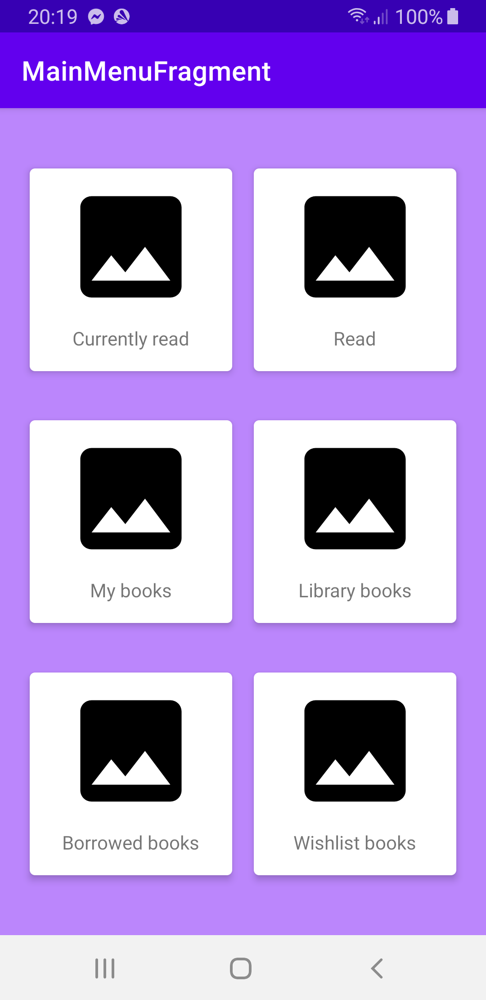
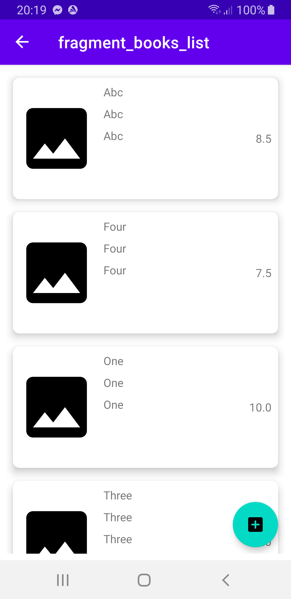
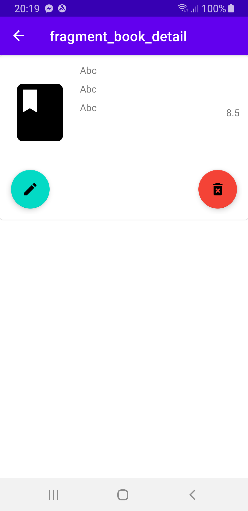
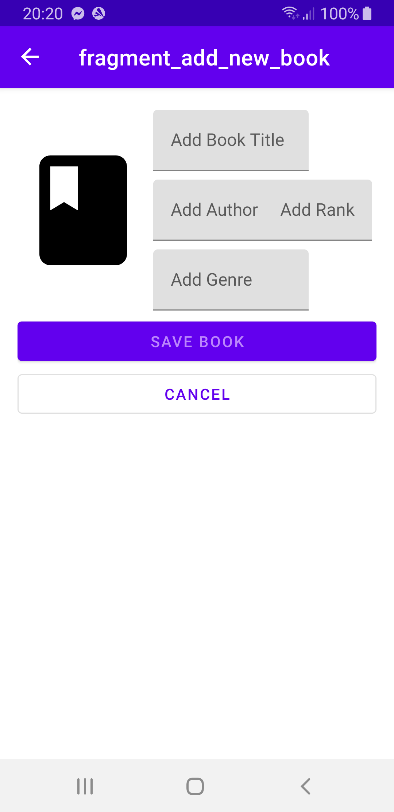

# MyBookshelf app

# The application is under development!

## Current state of app

- working part of temporary UI
- SQLite database created
- working and visible queries: INSERT, UPDATE, DELETE
- connection via ViewModel and Repository

# The application is under development!

## Screenshots of  current state of app (temporary UI)

## Description & Design assumptions/requirements

The aim of the application is to store objects representing physical books owned by the user.
The user wants to have a preview of their paper books within the application. The application
should allow adding, removing, and editing books on a virtual shelf. Adding books should be done
using a scanner for the ISBN number, which works through the device's camera, fetching data, for
example, from the Google Books API, or manually.

The books will be added to a global list with the ability to sort them by author, genre, or
user-rated review. From the main screen, the user will be able to select a screen displaying the
list of books borrowed from the library, books from the wishlist, currently being read, borrowed
from friends, or already read.

For items marked as borrowed, it will be possible to set notifications for upcoming return dates.

# The application is under development!